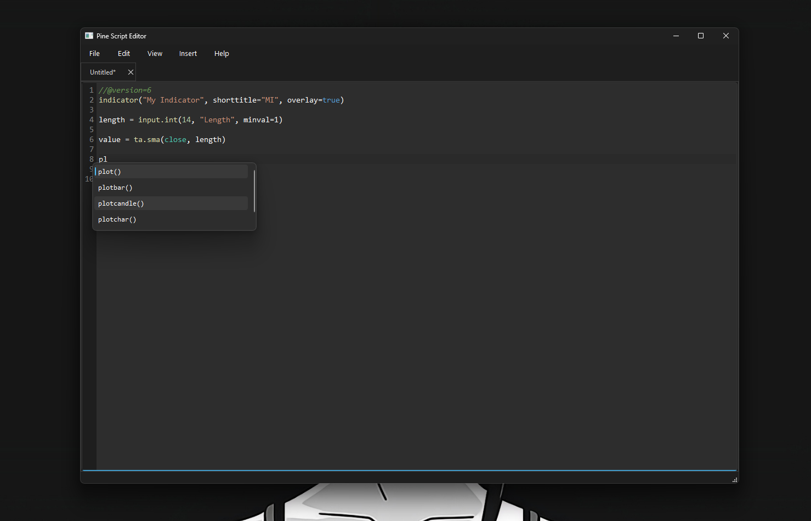

# Pine Script Editor


## Overview
A lightweight and powerful code editor for TradingView Pine Script V6, built with Python and PyQt6.  
Designed for fast development of trading strategies with autocomplete, syntax highlighting, and real-time validation.

---



# Features

## Core Editing
- Syntax highlighting for Pine Script V6 (200+ built-in functions supported)
- Line numbers with active line highlighting
- Multi-tab support
- Smart auto-indentation
- Automatic bracket, quote, and parenthesis matching

## Intelligent Features
- Autocomplete (`Ctrl+Space`) for:
  - Keywords (if, for, while, var, type, enum, etc.)
  - Built-in functions (ta.*, math.*, str.*, array.*, etc.)
  - Variables (open, close, high, low, volume, etc.)
- Real-time syntax validation:
  - Bracket matching
  - Pine Script V6 version checks
  - Deprecated parameter detection
  - Indentation errors
- Code snippets:
  - Indicators & strategies
  - RSI / Moving Average templates
  - Multi-timeframe examples
  - Array operations

## Customization
- Dark / Light themes
- Fully configurable settings
- Quick access to documentation

---

# Installation

## Requirements
- Python 3.8+
- pip

## Setup

```bash
pip install -r requirements.txt
```
```bash
python main.py
```

# Usage

## Keyboard Shortcuts
| Shortcut   | Action       |
| ---------- | ------------ |
| Ctrl+N     | New file     |
| Ctrl+O     | Open file    |
| Ctrl+S     | Save file    |
| Ctrl+Z     | Undo         |
| Ctrl+Y     | Redo         |
| Ctrl+Space | Autocomplete |
| Tab        | Indent       |
| Shift+Tab  | Unindent     |
| Ctrl+Q     | Quit         |

## Autocomplete

- Press Ctrl+Space to trigger suggestions:
  - ta. → technical analysis functions
  - math. → math operations
  - str. → string functions
  - array. → array utilities

## Snippets
- Basic Indicator
- Trading Strategy
- RSI Strategy
- Moving Average Crossover
- Array handling examples
- Multi-timeframe analysis

# Disclaimer
This software is provided "as is", without warranty of any kind.
The author is not responsible for any trading results or misuse of the software.

# License 
This project is licensed under the MIT License - see the [LICENSE](LICENSE) file for details.
